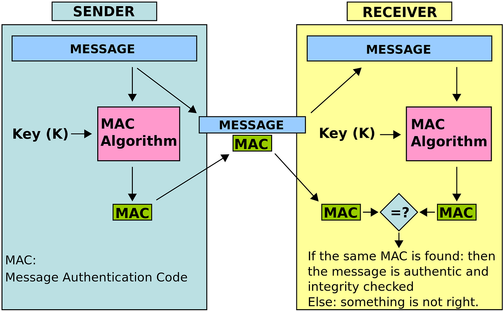
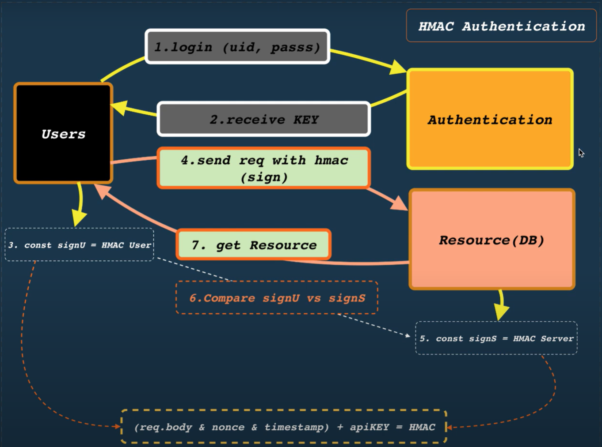
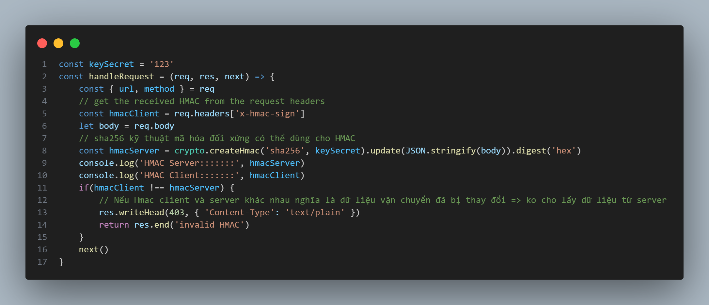
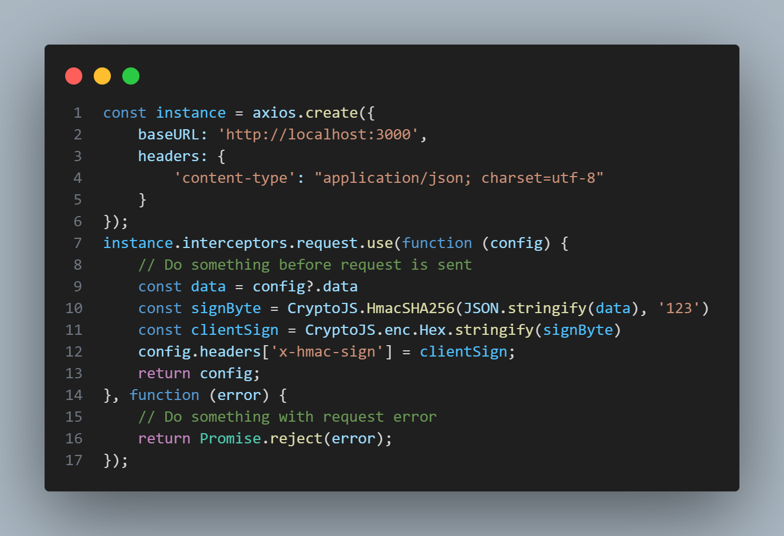
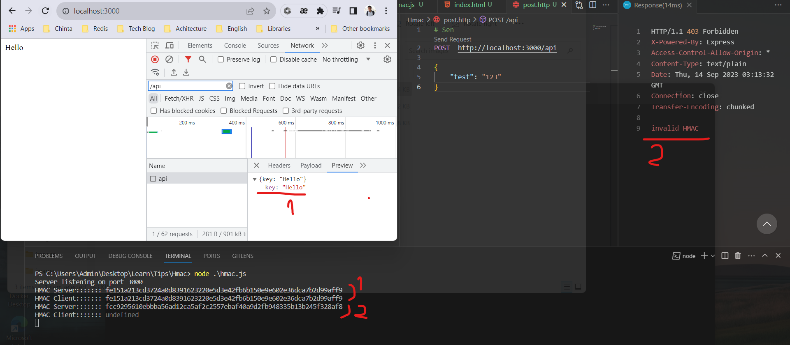

# HMAC là gì?
HMAC (Hash-based Message Authentication Code) là một thuật toán mã hóa thông điệp dựa trên hàm băm (hash function) và khóa bí mật (secret key). Nó được sử dụng để xác thực tính toàn vẹn và nguồn gốc của một thông điệp.

HMAC kết hợp việc sử dụng một hàm băm (như MD5, SHA-1, SHA-256) với việc sử dụng một khóa bí mật để tạo ra một mã xác thực (authentication code). Mã xác thực này được thêm vào thông điệp ban đầu và gửi kèm với thông điệp.

Khi nhận được thông điệp và mã xác thực, người nhận sẽ thực hiện lại quá trình tính toán HMAC bằng cùng một hàm băm và khóa bí mật được chia sẻ. Nếu mã xác thực tính được khớp với mã xác thực nhận được, điều này cho thấy thông điệp không bị thay đổi trong quá trình truyền và được gửi từ nguồn gốc được xác thực.

HMAC được sử dụng trong nhiều ứng dụng bảo mật như xác thực dữ liệu trong giao thức mạng (như SSL/TLS), xác thực API, xác thực người dùng trong hệ thống xác thực hai yếu tố, v.v. Nó cung cấp một cách an toàn và tin cậy để xác thực tính toàn vẹn và nguồn gốc của thông điệp.

# Triển khai code

Test
