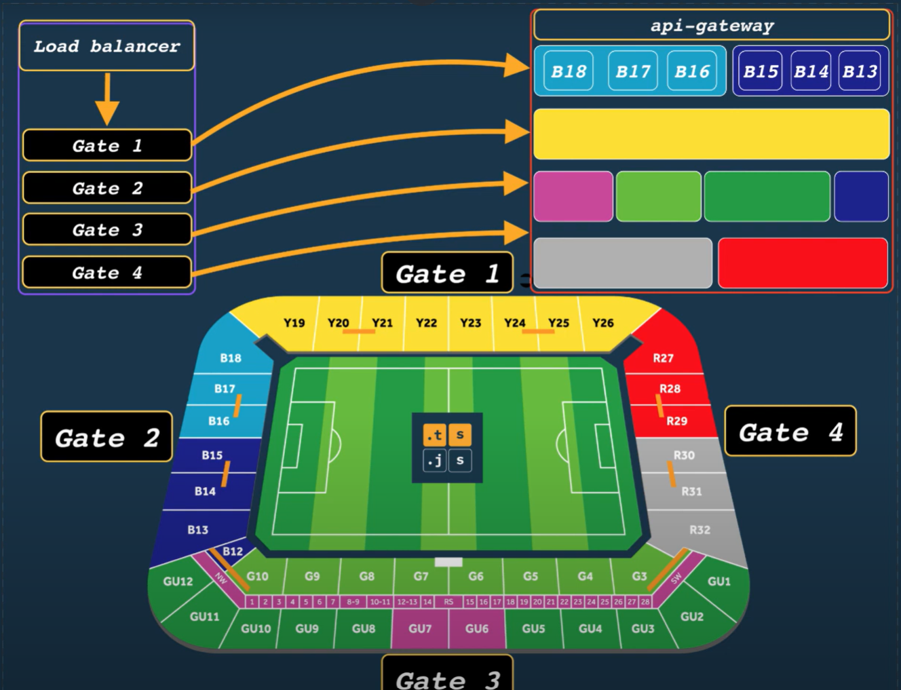
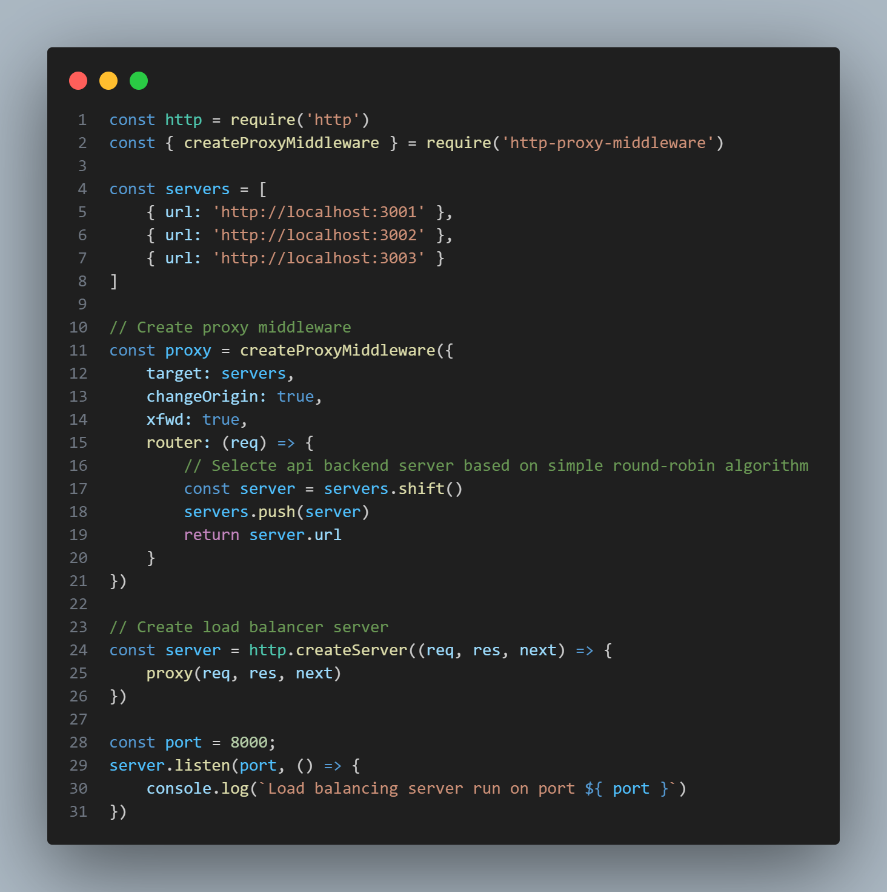
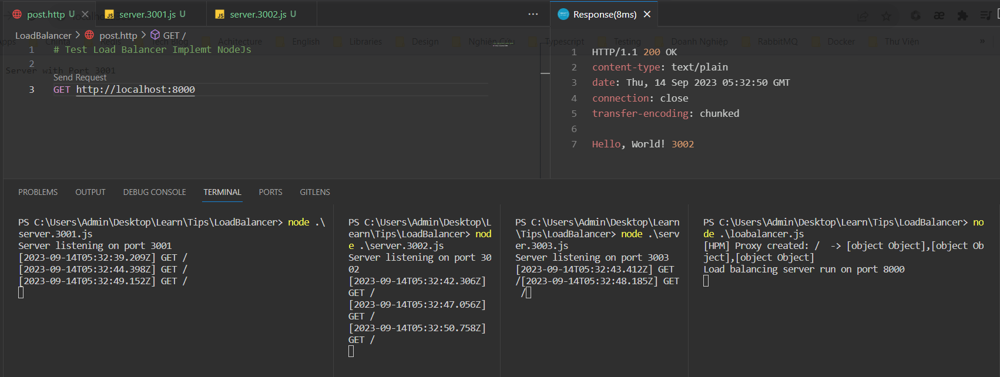

# Load Balancer - Cách chiến lược triển khai Load Balancer cho hệ thống

# Cách kỹ thuật và thuật toán của Load Balancing
## 1. Round - Robin
- Phân phối chia đều từng request từng lần cho từng server
- Cách này phải chia session cho nhau giữa các máy chủ

## 2. Ip Hash
- Phân phối request theo vị trí địa lý máy chủ trong hàm băm
- Cách này không phải chia session cho nhau giữa các máy chủ

## 3. Least Time
- Phân phối request ưu tiên máy chủ có phản hồi nhanh nhất

## 4. Least Connection
- Phân phối ưu tiên máy chủ có ít kết nối nhất

## 5. Weighted Round Robin
- Phân phối dựa theo trọng số server. Nghĩa là dựa vào tình trạng server đang mạnh hay yếu.

### Chọn cách thức cho Load Balancer thì phải tùy vào nhu cầu của hệ thống và từng giai đoạn của hệ thống. Mỗi bussines khác nhau. Và mỗi thuật toán đề có điểm mạnh điểm yếu riêng.

# Load Balancing và Api Gateway

# Code triển khai ví dụ load balancing với nodejs dùng kỹ thuật Round-Robin
- Trong thực tế công cụ để thực hiện load blancing là Nginx hoặc Apache. Nhưng Code bên dưới là dùng để mô tả cách triển khai Load Balancer trong Nodej với 3 máy chủ là 3001, 3002, 3004

Test kết quả
