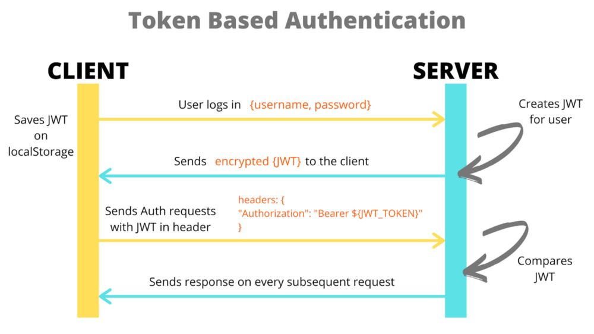

# 8 Giải pháp để bảo vệ dữ liệu án toàn với API

## 1. Token (JWT)
- Token bao gồm accessToken và refreshToken

## 2. Timestamp mechanism (cơ chế dấu thời gian)
- Mỗi lần client gửi yêu cầu sẽ mang theo 1 mốc thời gian hiện tại.

## 3. Signature Generation (sign - chống thay đổi payload)
- Chử ký của UI, có thể dùng Hmac

## 4. Nonce - Replay Attack
- Replay attack là tấn công API theo kiểu gửi lại nguyên vẹn endpoint đã thực hiện trước đó bao gồm hacker và chính người dùng 

## 5. Rate Limits
- Hạn chế request tới server N lần trên X phút

## 6. IP Access Limit

## 7. BlackList
- Từ IP Access Limit => thiết lập blacklist. Các IP trong blacklist trả thẳng về lỗi ko cho truy cập DB

## 8. WhiteList
- Các IP trong WhiteList thì ko cần phải check.